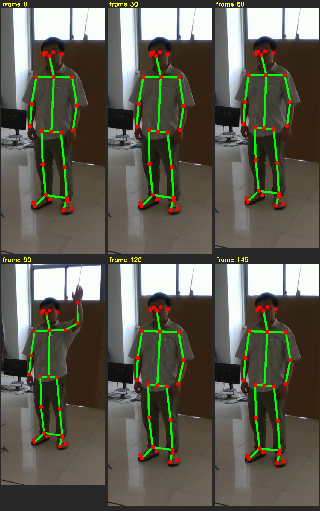
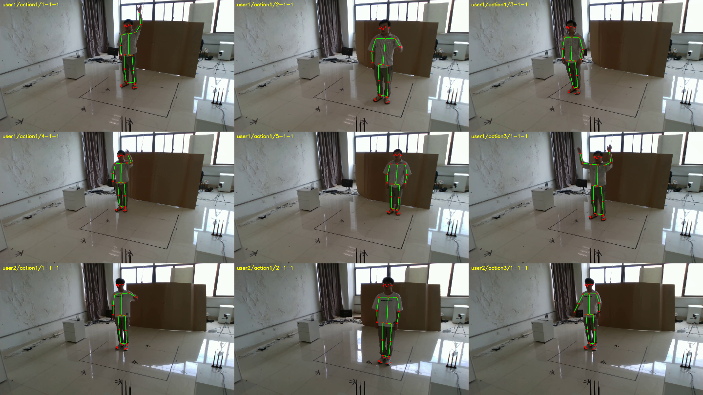

# Contest — PerceptAlign 復現(WiFi CSI → 3D 人體姿態)

本專案以論文 **PerceptAlign**（*Breaking Coordinate Overfitting: Geometry-Aware WiFi Sensing for Cross-Layout 3D Pose Estimation*, MobiCom 2026）為雛形做復現，作為比賽基礎。
原始碼/資料：[Trymore-lab/PerceptAlign](https://github.com/Trymore-lab/PerceptAlign) · arXiv:2601.12252

---

## 這個 repo 解決什麼問題

作者公開的資料集（HuggingFace Scene1–5）**只有 WiFi CSI + 3 路相機影片**，
**沒有訓練必需的 3D 骨架標註（GT）、相機校正、geometry_config**（keypoints 在一個私有資料集裡，拿不到）。

→ 本專案的核心貢獻：**用公開的 3 路影片，自己重建 3D 骨架 GT**，直接餵給 PerceptAlign 模型訓練。

### 關鍵方法（不需作者外參、不需深度、不需地板棋盤格）
```
3 路同步相機 → 同一個人的不同角度 = 天然跨視角對應點
  → 用「人體 2D 關節點」對極幾何自校正（cv2.findEssentialMat / recoverPose）
  → 多視角三角化 → 公制 3D 骨架 → 寫成 repo 的 keypoints3d 格式
```
原本最難的「相機自校正」被鏡面地板擋住（自動偵測失敗），改用**人體關節點**當校正靶後完全繞過。

---

## 成果（Scene1 pilot 已驗證）

| 指標 | 結果 |
|---|---|
| 重投影 RMS | **0.38 px**（2-view）/ 2 px（3-view）|
| 骨長變異 | 0–3% |
| 上臂/前臂/大腿/小腿/肩寬 | 0.28 / 0.24 / 0.39 / 0.39 / 0.38 m（全解剖正常）|

自製 3D 骨架投影回影片，完美貼合真人：




**端到端打通**：影片 → 2D 偵測 → 自校正 → 三角化 → BODY_25 GT → preprocess → 模型 forward/loss/backward。

---

## Repo 結構
```
PerceptAlign/               # 官方程式碼（MIT，已內含，不用另外 clone）
  perceptalign/ tools/ configs/ assets/ paper/ LICENSE
selflabel/
  scripts/
    detect_2d.py            # 步驟 A：rtmlib RTMW 2D 偵測
    calibrate_triangulate.py# 步驟 B+C：人體關節自校正 + 三角化
    make_gt_json.py         # 步驟 D：轉 BODY_25 + 寫 keypoints3d JSON
    batch_full.py           # 整場景批次（平行下載 + GPU + 自動 QC，可續跑）
    batch_process.py        # 小批次（沿用校正）
    calib_lib.py
  calib_scene1.npz          # Scene1 相機校正（可重用，相機固定）
  scene1_instances.txt      # Scene1 全 5,868 個 instance 清單（分工用）
geometry/scene1.json        # Scene1 的 tx/rx geometry_config（scene_matrix=I）
example_gt/1-1-1_keypoints3d/# 一個 instance 的 GT 範例（30 幀 × 25 關節）
samples/                    # 成果證明圖
docs/
  TRAIN_PY_EXPLAINED.md     # train.py 完整流程 ↔ 論文 Method 對照
  PLAN_SELF_LABEL.md        # 自標方法完整計畫
  PILOT_RESULTS.md          # pilot 數字
  SETUP_NOTES.md            # 跑官方 repo 的踩雷筆記
  CONTACT_AUTHORS.md        # 向作者要原始 GT 的信（備案）
```

---

## 環境
```bash
# Python 3.10 + CUDA 12.1。建議用 GPU。
pip install torch torchvision numpy h5py tqdm pyyaml opencv-python \
            rtmlib onnxruntime-gpu scikit-learn requests huggingface_hub
# onnxruntime GPU 需要 cudnn 在 LD_LIBRARY_PATH（nvidia-cudnn-cu12 套件內）
export LD_LIBRARY_PATH=$(python -c "import nvidia.cudnn,os;print(os.path.dirname(nvidia.cudnn.__file__))")/lib:$LD_LIBRARY_PATH
```

## 怎麼跑（三步）
```bash
# 0. 官方程式碼已內含在 PerceptAlign/，直接用。只需設 HF token 下載資料：
export HF_TOKEN=<你的 HuggingFace read token>   # 下載資料用,別 commit！

# 1. 自標 GT：對一批 instance 下載影片→偵測→三角化→寫 keypoints3d
python selflabel/scripts/batch_full.py \
  --instances_file selflabel/scene1_instances.txt \
  --calib selflabel/calib_scene1.npz \
  --log scene1.log --workers 16
#   GT 會寫進 PerceptAlign/data/raw/Scene1/<inst>/default/smplx/keypoints3d/
#   把 geometry/scene1.json 放到 PerceptAlign/data/raw/Scene1/geometry_config.json

# 2. preprocess → .pt
cd PerceptAlign && PYTHONPATH=$(pwd) python tools/preprocess.py \
  --scene_root data/raw/Scene1 --out_root data/pp --apply_scene_transform

# 3. 訓練（cross_subject / cross_location split）
PYTHONPATH=$(pwd) python tools/train.py --config configs/<your>.yaml
```
細節與踩雷見 `docs/SETUP_NOTES.md`、`docs/TRAIN_PY_EXPLAINED.md`。

---

## 多人分工標註（給隊友）
Scene1 共 **5,868 個 instance**（`selflabel/scene1_instances.txt`）。要平行標註就把清單切片：
```bash
split -n l/4 selflabel/scene1_instances.txt part_   # 切成 4 份給 4 人
# 每人:python selflabel/scripts/batch_full.py --instances_file part_aa ...
```
- **Scene1 相機固定 → 大家共用同一份 `calib_scene1.npz`，座標系一致**，產出的 GT 可直接合併。
- 其他場景（Scene2/3/4/5）相機不同，需**各自重新自校正一次**（每場景跑一次 `calibrate_triangulate.py`）。

---

## 已知限制（誠實）
- GT 在**我們自定義的世界座標系**（非作者棋盤格座標系）→ **絕對 MPJPE 不可直接對比論文 Table 3**。
- 能復現的是**方法的相對效果**：開/關 geometry conditioning（`rel_rx`）對 cross-layout / cross-subject 退化的影響 —— 這正是論文「Breaking Coordinate Overfitting」的核心主張。
- 自標 GT 在快速動作/自遮擋的肢體會較噪（已用 conf 過濾 + reproj/骨長自動 QC 把關）。

## 引用 / 致謝
本專案為學術復現，資料與模型架構來自原作者，請引用原論文：
> Songming Jia, Yan Lu, Bin Liu, Xiang Zhang, et al. *Breaking Coordinate Overfitting: Geometry-Aware WiFi Sensing for Cross-Layout 3D Pose Estimation.* MobiCom 2026. arXiv:2601.12252.

## ⚠️ 安全
**絕對不要把 HuggingFace / GitHub token commit 進 repo**。用環境變數傳。
